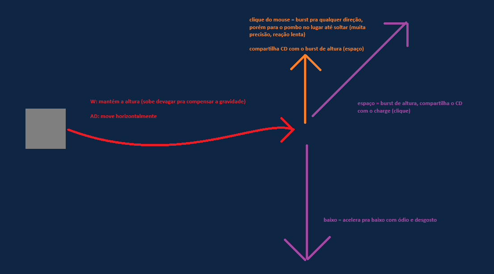

# Pombo Hacker

Gênero: Ação/Puzzle com elementos de time-attack e minigames de hacking

Tema: pombos urbanos, sci-fi, hacking, parkour aéreo

---

## História & Contexto

Você é um pombo treinado por uma rede de ativistas para interceptar e manipular transmissões de rádio das corporações que controlam a cidade.

Voando entre prédios, postes e drones de vigilância, sua missão é invadir redes, decifrar códigos e liberar informações sigilosas para o povo.

---

## Mecânicas Principais

### Movimentação

A movimentação do pombo é dividida entre estados: no chão e no ar.

- Segure `W` para começar a bater as asas e levantar voo.

**No Chão:**

- Use `A` e `D` para se mover para os lados com pequenos saltos (hops).

**No Ar:**

- Use `A` e `D` para controlar o movimento horizontal.
- Segure `S` para um mergulho rápido para baixo.

**Habilidades Especiais:**

- O **impulso** (`Espaço`) e o **dash** (`Mouse`) compartilham um tempo de recarga, mas o impulso recarrega um pouco mais rápido.

## Perigos, Obstáculos e Objetivos

- Drones de vigilância movem-se em padrões previsíveis;
  - Colidir com drones causa dano ao pombo, reduzindo suas vidas;
  - Drones podem ser destruídos se atingidos nos pontos fracos com o impulso do pombo;
- Obstáculos como postes, prédios e fios de alta tensão devem ser evitados;
  - Colidir com obstáculos causa dano ao pombo, reduzindo suas vidas;
- Antenas de transmissão são os principais objetivos;
  - Antenas são marcadas com um ícone visível à distância;
  - Hackear antenas desbloqueia novos setores e concede pontos;

### Minigames de Hacking

- Ao chegar próximo a uma antena, aperte a tecla `F` ou `Enter` para pousar e abrir a interface de hacking.
- Os hackings são minigames baseados em tempo, onde você deve digitar uma sequência de caracteres ou resolver um quebra-cabeça simples.
- O tempo para completar o hacking é limitado, e cada antena tem um nível de dificuldade crescente.
- Se o hacking for bem-sucedido, a antena é hackeada e você recebe pontos e desbloqueia o próximo setor.

---

## Interface & UI

- HUD minimalista mostrando pontos, vidas e, durante o hacking, um temporizador.
- Tela de hacking ocupa parte da tela, com fonte monoespaçada e feedback de sucesso/erro.
